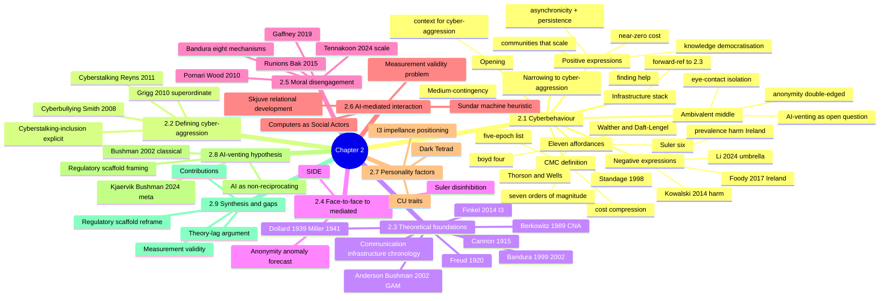

# Chapter 2 — Literature Review: Working Outline (v3, cyberbehaviour-first reframe)

**Document status:** Working outline, not a chapter draft.
**Date:** 23 April 2026
**Author:** Todd McCaffrey
**Project:** *Understanding Cyber-Aggression through AI Use, Trust, and Personality Factors* (UCA)
**Supervisor:** Dr Gerry McWilliams
**Target word budget:** 3,500–4,000 words for Chapter 2

---

## Purpose of this document

This is a working structural outline for Chapter 2. It captures the second reframe agreed in drafting session 2026-04-23: moving from the data-first opening of v2 to a **cyberbehaviour-first** architecture. The chapter now opens with cyberbehaviour as genus and narrows to cyber-aggression as species, passing through the good/ambivalent/bad expression structure.

The reframe was motivated by the drafting work on the cyberbehaviour umbrella itself. What began as a framing paragraph for section 2.2 grew into a full taxonomic treatment — eleven affordances synthesised across four theoretical lineages (Suler, boyd, Walther/Daft-Lengel, Thorson-Wells), followed by positive, ambivalent, and negative expression categories. This material is not a digression from the cyber-aggression argument; it *is* the argument's foundation. Placing it first prevents the moral-panic framing that treats cyber-aggression as the whole of cyberbehaviour rather than as one specific negative expression.

The theoretical material (Freud → Finkel) and the infrastructure chronology remain in section 2.3 where v2 placed them. The prevalence/harm/Ireland empirical anchor moves into 2.1's negative-expressions subsection, where it does load-bearing work as the bridge from cyberbehaviour generally to cyber-aggression specifically.

---

## Chapter 2 mind map

---

## Section structure (v3)

### 2.1 Cyberbehaviour *(~1,000–1,400 words)*

**Purpose.** Establish cyberbehaviour as the genus within which cyber-aggression sits as species. Build the eleven-affordance umbrella, walk through positive/ambivalent/negative expressions, and narrow to the specific negative expression the dissertation examines. This is the largest section of the chapter because it is doing the conceptual, empirical, and rhetorical work that the other sections depend on.

**Subsection structure.**

**2.1.1 Opening and CMC definition.** Cyber-aggression needs context; the context is cyberbehaviour. CMC defined as conduct shaped by computer-mediated communication. Cost-compression sentence using Standage (1998) as anchor — communication cost collapsed by roughly seven orders of magnitude from 1866 transatlantic telegram to 2026 digital infrastructure.

**2.1.2 Medium-contingency and infrastructure substrate.** Cyberbehaviour is not offline behaviour in a new medium; it is human interaction in a new cost regime. The substrate is the product of a cumulative infrastructure stack built over decades with each layer responding to the frictions of the one beneath. Forward reference to section 2.3 where the chronology is developed.

**2.1.3 Eleven-affordance umbrella.** The structural affordances that make cyberbehaviour categorically different from face-to-face behaviour. Integrates four theoretical lineages:

1. Dissociative anonymity (Suler, 2004)
2. Invisibility (Lapidot-Lefler & Barak, 2012)
3. Asynchronicity (Suler, 2004)
4. Solipsistic introjection (Suler, 2004)
5. Dissociative imagination (Suler, 2004)
6. Minimisation of authority (Suler, 2004)
7. Persistence (boyd, 2010)
8. Scale and reach (boyd, 2010)
9. Algorithmic mediation (Thorson & Wells, 2016)
10. Searchability and aggregation (boyd, 2010)
11. Reduced sensory bandwidth (Daft & Lengel, 1986; Walther, 1996)

Position the synthesis honestly: constituent parts are established in source literatures; contribution is to apply the integrated framework to cyber-aggression research, where prior integration (Runions & Bak, 2015) is narrower in scope. Evans, Pearce, Vitak & Treem (2017) cited for the methodological case that such synthesis is needed.

**2.1.4 Positive expressions.** Cyberbehaviour produces uniformly beneficial outcomes that the moral-panic framing elides. Five-item parallel list:

1. Communities that scale — marginal groups, rare conditions, dispersed identities (McKenna & Bargh, 1998; boyd, 2010)
2. Finding help — disclosure, help-seeking, benign disinhibition (Suler, 2004; Lapidot-Lefler & Barak, 2015)
3. Democratisation of knowledge — Wikipedia, open-access repositories, scholarly search
4. Near-zero communication cost — relationship maintenance across distance
5. Asynchronicity and persistence — considered response, durable record (Suler, 2004; boyd, 2010)

**2.1.5 The ambivalent middle.** Affordances that produce neither uniformly positive nor uniformly negative outcomes; the expression depends on context, target, and disposition. Anonymity protects whistleblowers and abuse survivors while enabling harassment — a genuine ambivalence rather than a balance to be resolved. Lapidot-Lefler & Barak's (2012) experimental isolation of lack-of-eye-contact as the principal driver of toxic disinhibition suggests the mechanism operates at a finer grain than early accounts held.

This subsection is where the **AI-venting hypothesis gets structurally positioned** before section 2.8 develops it. The classical venting literature (Bushman 2002, Kjærvik & Bushman 2024) concerned human targets; whether that finding transfers to non-reciprocating interlocutors such as large language models is an open question. Positioning the hypothesis here — inside the ambivalent middle — avoids announcing it prematurely while laying the conceptual groundwork for 2.8.

**2.1.6 Negative expressions — and the empirical anchor.** The uniformly harmful expressions of cyberbehaviour. This is where the prevalence/harm/Ireland data lives, because the harm data are the empirical reason the dissertation narrows to this specific subset rather than cyberbehaviour generally.

- Umbrella review: Li, Wang, Martin-Moratinos, Bella-Fernández & Blasco-Fontecilla (2024). 56 meta-analyses, 296 effect sizes, sample range 421–1,136,080. The flagship citation for harm outcomes.
- Prevalence anchors: Modecki et al. (2014) for ~15% pooled estimate; Zhu et al. (2021) for cross-national range.
- Harm outcomes: Kowalski, Giumetti, Schroeder & Lattanner (2014) meta-analysis — depression, anxiety, self-harm, suicidal ideation.
- Ireland anchor: Foody, Samara & O'Higgins Norman (2017) — school-age population; the only all-Ireland meta-analytic anchor available.
- University-population thematic: Bussu et al. (2025) for the 3.7–92% range (itself diagnostic of the measurement-validity problem); Oksanen et al. (2022) for academic-population exposure to online hostility.
- Methodological precedent: Tennakoon et al. (2024) for the vignette paradigm and university-population focus.

Name the family: cyber-aggression covers cyberbullying, cyberstalking, trolling, doxing, sextortion, coordinated harassment, hostile impersonation. Runions & Bak (2015) for the affordance-to-moral-disengagement link within this family.

**2.1.7 Narrowing move.** The dissertation examines one specific negative expression — cyber-aggression — in the Irish adult university population. Section 2.2 defines the term; subsequent sections develop the theoretical apparatus (2.3), the mediated-context literature (2.4), the moral disengagement mechanism (2.5), the AI-specific territory (2.6), personality factors (2.7), and the venting hypothesis (2.8).

**What this section does NOT do.**
- No theoretical lineage. Freud → Finkel deferred to 2.3.
- No formal definition of cyber-aggression. Working gesture only; formal definition in 2.2.
- No AI-specific hypotheses. Those live in 2.6 and 2.8.

---

### 2.2 Defining cyber-aggression *(~400–500 words)*

**Purpose.** Establish the working definition that the rest of the chapter operates under. Position cyber-aggression as superordinate category with internal diversity, name cyberbullying and cyberstalking explicitly as members, then narrow to the reactive-hostile-intent aspect the dissertation measures.

**Key sources.**
- Grigg (2010, p. 152). Working superordinate definition: "intentional harm delivered by the use of electronic means to a person or a group of people, irrespective of their age, who perceive(s) such acts as offensive, derogatory, harmful or unwanted." Grigg explicitly names cyberstalking as a member of the superordinate category.
- Smith, Mahdavi, Carvalho, Fisher, Russell & Tippett (2008, p. 376). Canonical cyberbullying definition: "an aggressive, intentional act carried out by a group or individual, using electronic forms of contact, repeatedly and over time against a victim who cannot easily defend him or herself." Ports Olweus's three traditional-bullying criteria (intentionality, repetition, power imbalance) into electronic context.
- Reyns, Henson & Fisher (2011). Cyberstalking as "repeated, unwanted pursuit of another person that incites fear in the victim" via electronic means.
- Runions (2013). Typology of cyber-aggression motives.
- Tokunaga (2010). Alternative definition cited for comparison.

**Structural moves.**
1. Grigg (2010) as working definition. Include the p. 152 quotation; note that Grigg's framing already positions cyberstalking inside the superordinate category.
2. Cyberbullying (Smith et al., 2008) and cyberstalking (Reyns et al., 2011) as members, each with definition and distinguishing features. The inclusion-of-cyberstalking claim is made explicitly — this is not a novel move but a restatement of Grigg's founding position.
3. Scope the dissertation. The study examines *reactive hostile intent under standardised provocation*, operationalised via the Tennakoon et al. (2024) vignette paradigm. This captures reactive single-incident hostile intent; it does not capture persistence (cyberstalking), coordination (pile-ons), or instrumental harassment.
4. Flag the measurement validity issue (framing point 2). The Bussu et al. 3.7–92% range reflects measurement variation more than true prevalence difference. The problem becomes acute in AI-mediated contexts — foreshadowing 2.6.

---

### 2.3 Theoretical foundations *(~700–900 words)*

**Purpose.** Trace the theoretical lineage that produced contemporary cyber-aggression research, integrated with the communication infrastructure chronology that 2.1 forward-referenced. Humanised history — figures as people making specific intellectual moves at specific moments.

**Key sources and figures.**
- Freud (1920). *Beyond the Pleasure Principle*. Aggression as its own drive.
- Cannon (1915). Biological substrate; fight-or-flight.
- Dollard, Doob, Miller, Mowrer & Sears (1939). *Frustration and Aggression*. Yale IHR.
- Miller (1941). Walk-back of the strong FAH claim.
- Berkowitz (1989). Cognitive Neoassociationistic Model. Built on the spreading-activation machinery (Quillian 1968; Collins & Loftus 1975; Anderson 1983) — chronology to be preserved precisely.
- Bandura (1999, 2002). Social learning theory; moral disengagement.
- Anderson & Bushman (2002). General Aggression Model.
- Finkel (2014). I³ Model. Multiplicative reorganisation.
- Communication infrastructure thread: Shannon (1948), Wiener (1948), ARPANET (1969), TCP/IP (Cerf & Kahn, 1974), Berners-Lee (1989/1993), Linux (Torvalds, 1991), Apache (1995). Each layer as response to the frictions of the one before.

**Structural moves.**
1. Open with Freud, 1920, Vienna. Aggression as theoretical object.
2. Cannon as adjacent biological substrate.
3. Dollard (1939), Miller (1941) walk-back.
4. Berkowitz's arc compressed — 1958 catharsis critique, 1962 cognitive turn, 1989 CNA reformulation.
5. Bandura; GAM; I³.
6. Communication infrastructure interleaved — aggression theory built for face-to-face contexts; infrastructure changed underneath the theory; section 2.4 develops the theoretical response to that change.
7. Closing sentence: the lineage's assumption of theoretically-neutral communication infrastructure becomes central from 2.4 onward.

---

### 2.4 From face-to-face to mediated contexts *(~350–450 words)*

**Purpose.** Name the infrastructural shift's theoretical consequences. Introduce SIDE and online disinhibition as the first theoretical responses to CMC.

**Key sources.**
- Postmes, Spears & Lea (1998); Reicher, Spears & Postmes (1995). SIDE.
- Suler (2004). Online Disinhibition Effect.
- Tanis & Postmes (2007). SIDE empirical development.
- Lapidot-Lefler & Barak (2012). Eye contact isolation.

**Structural moves.**
1. The infrastructure question. Aggression theory built for face-to-face; networked communication breaks the calibration.
2. SIDE as social-identity response.
3. Suler's six factors (already introduced in 2.1 as affordances; here developed theoretically).
4. Complication flag: identifiability sometimes *increases* hostile behaviour (forecasts the UCA anonymity anomaly finding, β = −.232).

---

### 2.5 Moral disengagement *(~350–450 words)*

**Purpose.** Establish moral disengagement as the cognitive machinery that makes cyber-aggression perpetration possible, and as the empirically dominant predictor in the UCA literature.

**Key sources.**
- Bandura (1999, 2002). Eight mechanisms.
- Pornari & Wood (2010). Moral disengagement in cyberbullying specifically.
- Runions & Bak (2015). Affordance-to-mechanism mapping; already cited in 2.1.
- Gaffney et al. (2019). Meta-analytic confirmation.
- Tennakoon et al. (2024). Scale used in UCA.

**Structural moves.**
1. Bandura's framework.
2. Application to online contexts.
3. Empirical track record.
4. UCA's measurement approach; expected replication as dominant predictor (β = .478 in the data); interpretation in Chapter 5.

---

### 2.6 AI-mediated interaction as new territory *(~400–500 words)*

**Purpose.** Introduce AI use, trust, and disinhibition as novel constructs; establish the measurement-validity framing point; pre-empt the null AI result.

**Key sources.**
- Nass & Moon (2000); Reeves & Nass (1996). Computers as Social Actors.
- Sundar (2020). Machine Heuristic.
- Skjuve et al. (2021, 2022). Human-AI relational development.
- Shi et al. (2023). Trust in AI scales.
- AI Disinhibition scale (specific scale used in UCA).

**Structural moves.**
1. AI-mediated interaction as qualitatively different infrastructural shift.
2. Computers-as-Social-Actors inheritance.
3. AI use, trust, disinhibition as candidate constructs.
4. Measurement validity problem — instruments built for AI-as-tool paradigms applied to AI-as-social-agent contexts. Frames the null AI block (ΔR² = .002) as measurement issue rather than hypothesis failure.

---

### 2.7 Personality factors *(~300–400 words)*

**Key sources.**
- Dark Triad / Dark Tetrad (Paulhus & Williams, 2002; Buckels, Trapnell & Paulhus, 2014).
- Callous-unemotional traits (Frick et al., 2014).
- Agreeableness / Big Five relationships.
- UCA-specific trait measurement.

**Structural moves.**
1. Why personality.
2. Dark Tetrad findings.
3. CU traits motivation.
4. I³ positioning — personality as impellance factor.

---

### 2.8 The AI-venting hypothesis *(~300–400 words)*

**Purpose.** Develop the specific empirical hypothesis previously positioned in 2.1.5 — the dissertation's most novel empirical contribution (venting item r ≈ −.201, p ≈ .017 in the UCA data).

**Key sources.**
- Bushman (2002). Venting feeds rather than extinguishes aggression.
- Bushman, Baumeister & Stack (1999). Earlier experimental precedent.
- Kjærvik & Bushman (2024). Meta-analytic closure of the human-venting literature.
- Skjuve et al. (2022). AI emotional support use.
- Reeves & Nass (1996). AI-as-substitute-social-partner framing.
- Barrett (2020). Regulatory scaffold argument — framing point 3.

**Structural moves.**
1. The classical finding — human-target venting rehearses aggression.
2. The reopening question — AI as non-reciprocating interlocutor may break the rehearsal mechanism.
3. Empirical prediction — AI venting may correlate negatively with hostile response likelihood.
4. Theoretical positioning — not a claim that catharsis works after all; a claim that the rehearsal mechanism requires a reciprocating target, and AI is a genuinely distinct case. Barrett's regulatory-scaffold framing supplies the positive theoretical account.

---

### 2.9 Synthesis and gaps *(~300–400 words)*

**Structural moves.**
1. What the literature shows.
2. Where it falls short — theory-lag, measurement validity, venting assumption, Irish adult gap.
3. The dissertation's specific contributions.
4. Closing hypothesis statement or bridge to Chapter 3.

---

## Framing points — integration across sections

**Framing point 1: The theory-lag argument.** Introduced in 2.1 (infrastructure precedes theoretical frameworks); developed in 2.3 (the Freud-to-Finkel lineage is a slow response to pre-existing phenomena, interleaved with the communication infrastructure chronology); sharpened in 2.4 (SIDE and disinhibition as decade-late responses); returned to in 2.9.

**Framing point 2: The measurement-validity problem.** Introduced in 2.1.6 (Bussu et al. 3.7–92% range); developed in 2.2 (instrument variation); sharpened in 2.6 (AI-as-tool instruments in AI-as-social-agent contexts); returned to in 2.9 (the null AI block as measurement issue).

**Framing point 3: The regulatory-scaffold reframe.** Introduced tentatively in 2.1.5 (AI-venting as open question inside the ambivalent middle); developed in 2.6 (AI as simulated scaffold); sharpened in 2.8 (venting as empirical signal that AI partially functions as regulatory partner); Barrett (2020) as theoretical anchor.

---

## Revision history

**v1 (2026-04-21, superseded).** Theory-first structure: 2.1 Theoretical Foundations (Freud and Cannon), 2.2 Communication Cost, 2.3 Cyber-Aggression Definition, 2.4 SIDE, 2.5 Moral Disengagement, 2.6 AI Constructs, 2.7 Personality, 2.8 AI Catharsis, 2.9 Gaps.

**v2 (2026-04-23 morning, superseded).** Data-first reframe. 2.1 becomes contemporary problem statement; theoretical lineage moves to 2.3; section numbers shift. Rationale: data-first answers the examiner's first question directly and produces the critical-eye framing.

**v3 (2026-04-23 evening, current).** Cyberbehaviour-first reframe. 2.1 becomes cyberbehaviour umbrella (genus), narrowing through good/ambivalent/bad expressions to cyber-aggression (species) as 2.2. Prevalence/harm/Ireland data moves into 2.1's negative-expressions subsection as the empirical bridge from cyberbehaviour generally to cyber-aggression specifically. Rationale: the cyberbehaviour umbrella developed in drafting is not scene-setting for cyber-aggression; it *is* the conceptual foundation the cyber-aggression argument rests on. Placing it first prevents the moral-panic framing and keeps the positive/ambivalent/negative taxonomy honest.

---

## Drafting status

| Section | Status |
|---|---|
| 2.1 Cyberbehaviour — opening paragraphs | Partial draft (2.1.1–2.1.3 drafted in session 2026-04-23; positive-expressions list draft-in-progress; ambivalent and negative expressions not drafted) |
| 2.2 Defining cyber-aggression | Not drafted |
| 2.3 Theoretical foundations | Partial draft exists (from v1 section 2.1); needs integration into new position and communication-infrastructure interleaving |
| 2.4 Face-to-face to mediated | Not drafted |
| 2.5 Moral disengagement | Not drafted |
| 2.6 AI-mediated interaction | Not drafted |
| 2.7 Personality factors | Not drafted |
| 2.8 AI-venting hypothesis | Not drafted |
| 2.9 Synthesis and gaps | Not drafted |

**Next drafting actions:**
1. Three residual fixes to 2.1.1 opening paragraph (CMC addition: "Which" fragment, double-space typo, self-reference issue)
2. Strip item 3 of positives back to affordance-only (defer historical detail to 2.3)
3. Rewrite item 5 of positives with parallel structure and citations
4. Draft 2.1.5 ambivalent middle
5. Draft 2.1.6 negative expressions (prevalence/harm/Ireland data)
6. Draft 2.1.7 narrowing move to 2.2
